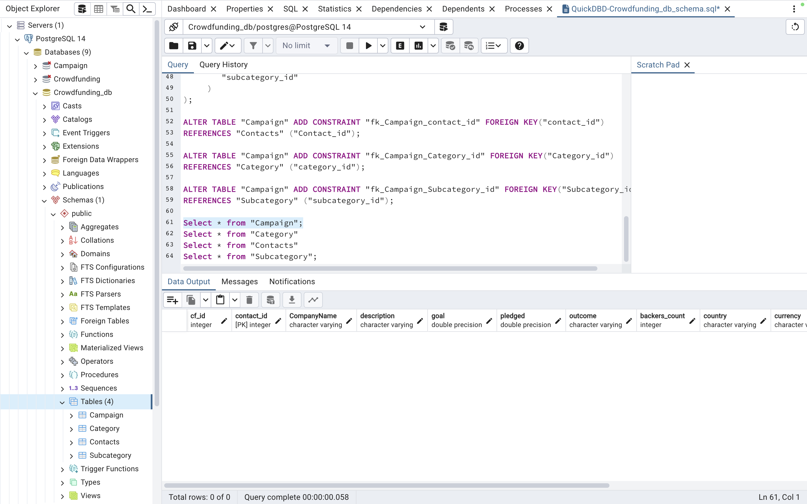
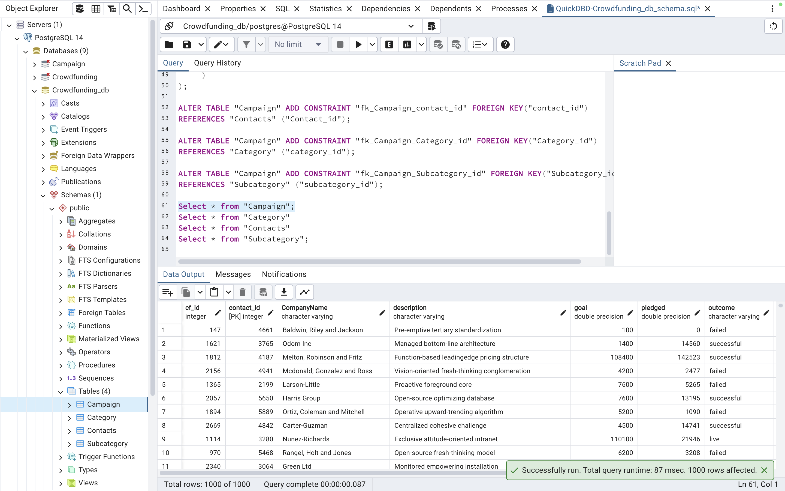
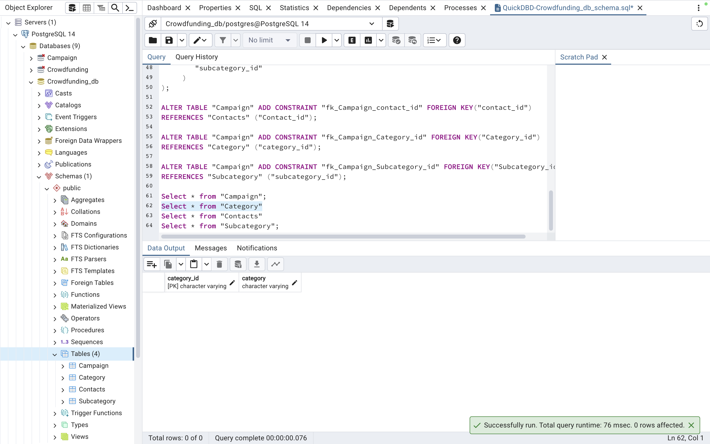
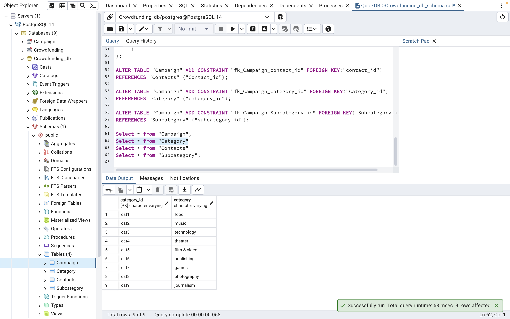
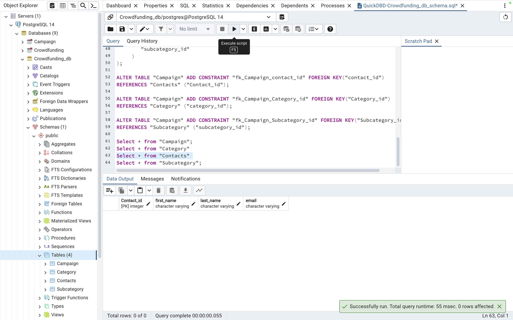
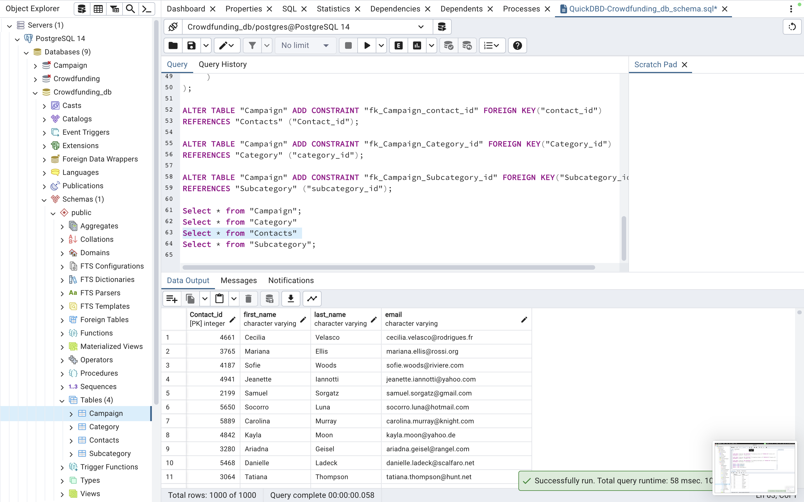
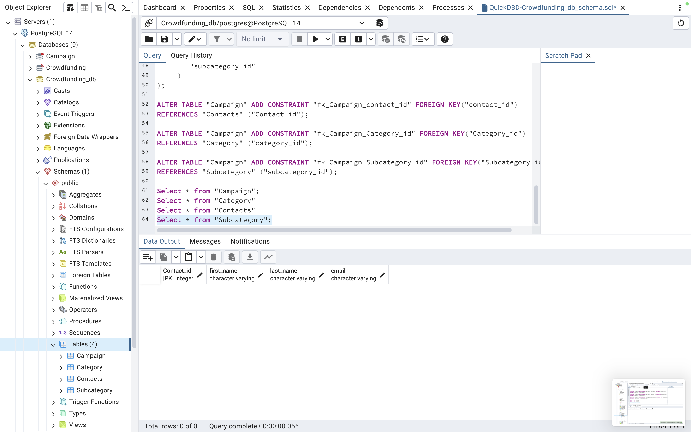
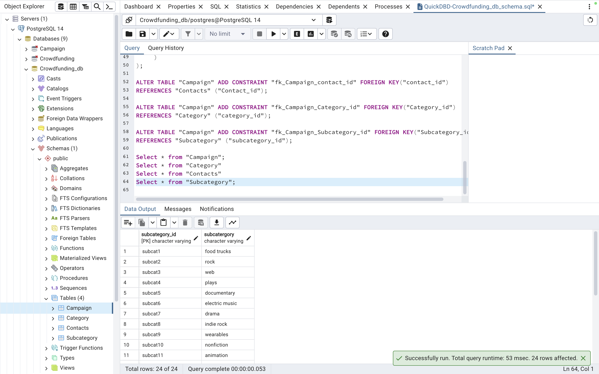

# Project-2

objective: Constructing an ETL pipeline using Python, Pandas, to extract and modify the data. Following data transformation,we have generated four CSV files and utilize the data from these files to establish an Entity-Relationship Diagram (ERD) and a table schema. Subsequently, imported the CSV file data into a Postgres database. 

Campaign table: 

 

Category table: 

 

Contacts table: 

Subcategory table: 

## Group members: Kai Huang, Aryan Linga, Laura Liu, Lachlan Porter 

## Resources 
Xpert Learning Assistant - https://bootcampspot.instructure.com/courses/4781/external_tools/313
